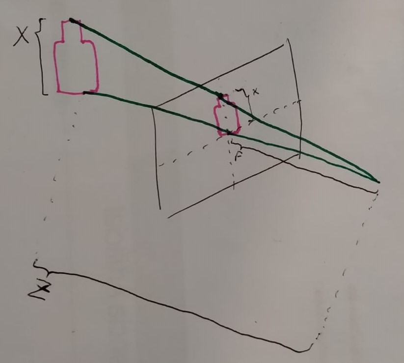

# HANDS

## Índice

- [Enunciado](#enunciado)
- [Solución](#solución)
- [Explicación detallada](#explicación-detallada)
  - [1. Mostrar una cámara](#1-mostrar-una-cámara)
  - [2. Dibujar la palma de la mano y los dedos](#2-dibujar-la-palma-de-la-mano-y-los-dedos)
  - [3. Calcular qué dedos hay levantados](#3-calcular-qué-dedos-hay-levantados)
  - [4. Calcular el ángulo de orientación de la mano](#4-calcular-el-ángulo-de-orientación-de-la-mano)
  - [5. Controlar una aplicación](#5-controlar-una-aplicación)
  - [6. Calcular la distancia de la mano a la cámara](#6-calcular-la-distancia-de-la-mano-a-la-cámara)
- [Explicación de la fórmula para el cálculo de la distancia de la mano a la cámara](#explicación-de-la-fórmula-para-el-cálculo-de-la-distancia-de-la-mano-a-la-cámara)
- [Bibliografía utilizada](#bibliografía-utilizada)

## Enunciado
Amplía el ejemplo `code/DL/hands/mano.py` hecho en clase para reconocer gestos simples, como por ejemplo contar el número de dedos extendidos. Haz un controlador sin contacto de varios grados de libertad que mida, al menos, distancia de la mano a la cámara y ángulo de orientación. Utilízalo para controlar alguno de tus programas.

## Solución
Se encuentra la solución en `mano.py`. El programa controlado es `programa.py`, que abre una ventana, de manera que se vea de forma clara cómo se abre o cierra el programa con los gestos de la mano. 

Si se extienden los dedos, el programa se abre. Si se cierran los dedos, el programa se cierra.

## Explicación detallada

Este programa realiza las siguientes tareas:

### 1. Mostrar una cámara

Se captura cada fotograma, se procesa para realizar las tareas indicadas posteriormente, y se muestra.

### 2. Dibujar la palma de la mano y los dedos

Obteniendo los puntos de la mano con la herramienta 'MediaPipe Hands', se han realizado líneas entre el principio y el final de los dedos de la mano. 

Para la palma, primero se ha obtenido el centro de tres puntos que se encuentran en el borde de la palma, de forma que se obtiene el centro de la palma. En segundo lugar, se obtiene el radio, calculado como la distancia entre el centro y un punto que está al borde de la palma. De esta forma, se puede dibujar un círculo en la palma con el centro y radio calculados.

### 3. Calcular qué dedos hay levantados

Para los dedos índice, corazón, anular y meñique, se ha calculado si se encuentran abiertos o cerrados usando la distancia entre el punto más bajo de la palma y el principio o el final del dedo. Si el dedo se encuentra cerrado, la distancia entre el punto más bajo de la palma y el final del dedo será menor que la distancia entre el punto más bajo de la palma y el principio del dedo. Si está abierto, es al contrario (es mayor).

Para el dedo pulgar, se ha considerado abierto si el principio del índice está más cerca del final de la mano que el final del pulgar. Si está más lejos, el dedo pulgar está cerrado.

### 4. Calcular el ángulo de orientación de la mano

Para calcular el ángulo de orientación de la mano, se ha calculado el ángulo entre dos vectores, el vector horizontal y el vector que se encuentra entre el final de la palma y el principio del dedo corazón. El segundo vector debe formar 0 grados con el horizontal si la mano está horizontal, y si esta empieza a girar, se calcula el ángulo.

Si el principio de la palma está más a la izquierda que el principio del dedo corazón, entonces el ángulo es negativo. Esto se realiza comparando la componente x de los puntos.

### 5. Controlar una aplicación

Si todos los dedos están levantados, se abre la aplicación, y si todos están cerrados se cierra. La condición ya estaba calculada en el cálculo de los dedos levantados.

### 6. Calcular la distancia de la mano a la cámara

Se usa la palma de la mano para calcular la distancia. Se calcula con la fórmula siguiente:

$$\frac{\text{distancia focal} * \text{ancho de la palma en centímetros}}{\text{ancho de la palma en píxeles}} = \text{distancia a la cámara en centímetros}$$

Para calcular la distancia focal, se ha utilizado la herramienta *calibrate.py*, que se puede encontrar en [el material de la asignatura](https://github.com/albertoruiz/umucv/tree/master/code/calibrate). Las fotografías tomadas para el cálculo de la distancia focal se encuentran en la carpeta `pattern`.

## Explicación de la fórmula para el cálculo de la distancia de la mano a la cámara

La distancia focal es la distancia (en píxeles) desde el centro del objetivo de la cámara hasta el sensor de esta. El objetivo es el lugar donde se encuentra la lente de la cámara, y el sensor es donde se proyecta la luz de la imagen para poder procesarla o almacenarla.

La distancia focal se obtiene realizando la calibración de la cámara. Su obtención es muy útil, debido a que con esta se puede calcular la distancia de la cámara a un objeto (dada una fotografía), si se sabe el tamaño de este en la realidad y en la fotografía.

Para explicar la fórmula para obtener la distancia, se necesita un objeto. Es este caso, se va a explicar con un esquema cuyo objeto es una botella:

Como se puede observar: X es la altura de la botella en el mundo real, Z es la distancia de la cámara a la botella, x es la altura de la botella en la fotografía tomada, y f es la distancia focal.

Se puede observar como se forman dos triángulos (uno con lados f y x, y otro con lados X y Z). Los triángulos se encuentran en posición de Thales, por lo que se obtiene la siguiente fórmula:

$$\frac{X}{Z}=\frac{x}{f}$$

Si se quiere obtener más información sobre el teorema de Thales, se puede observar la siguiente url: https://www.superprof.es/apuntes/escolar/matematicas/geometria/basica/triangulos-en-posicion-de-thales.html.

## Bibliografía utilizada

- [Comprender Hand Landmark - MediaPipe](https://github.com/google/mediapipe/blob/master/docs/solutions/hands.md)

- [Aprender a dibujar cuadrados](https://docs.opencv.org/3.4/d6/d6e/group__imgproc__draw.html#ga07d2f74cadcf8e305e810ce8eed13bc9)

- [Aprender a escribir texto](https://docs.opencv.org/3.4/d6/d6e/group__imgproc__draw.html#ga5126f47f883d730f633d74f07456c576)

- [Aprender a dibujar círculos: cv.circle](https://docs.opencv.org/3.4/d6/d6e/group__imgproc__draw.html#gaf10604b069374903dbd0f0488cb43670)

- [Funciones de math](https://docs.python.org/3/library/math.html)

- [Ángulo entre dos vectores (para calcular la orientación de la mano)](https://www.superprof.es/apuntes/escolar/matematicas/analitica/vectores/angulo-de-dos-vectores.html)

- [Material de la asignatura](https://github.com/albertoruiz/umucv/blob/master/notebooks/imagen.ipynb)

- [Entender qué es la distancia focal](https://www.sony.es/electronics/support/articles/00267921)

- [Entender qué es un sensor](https://www.blogdelfotografo.com/tipos-caracteristicas-ventajas-sensores-camaras-fotos/)

- [Teorema de Thales](https://www.superprof.es/apuntes/escolar/matematicas/geometria/basica/triangulos-en-posicion-de-thales.html)

Además, se ha utilizado ChatGPT para crear el programa llamado `programa.py`, el cual crea una ventana. Este se utilizó para controlarlo con `mano.py`, de forma que se vea la ventana abrirse y cerrarse según el gesto de la mano.